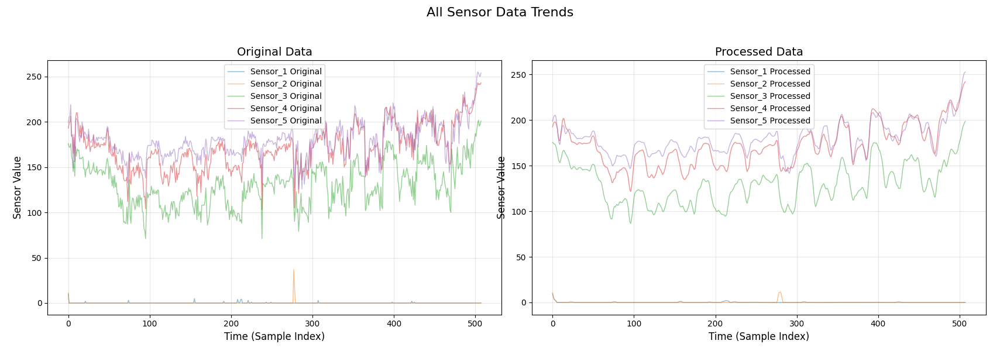
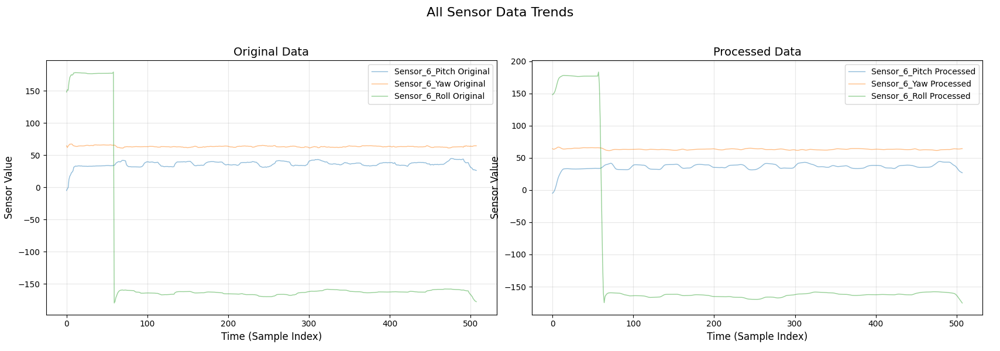
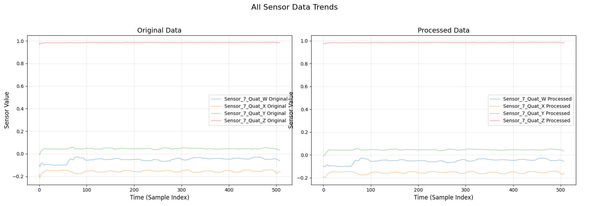

# 多模态信息融合感知的手势识别方法与系统设计

> 本科二年级时做的大学生创新创业项目，由王文东老师指导，我主要负责数据处理和手语识别算法部分的搭建。

## 项目初期：阅读论文了解开发流程

### 初步规划

这个项目的初衷就是：**设计一套可穿戴的嵌入式智能感知系统，能够不依靠视觉也可高效准确地识别军事手语并传递信息**

整个项目核心的理念就是采用**多模信息融合**的方式去“表示”军事手语

> 人体在做出动作的过程中，信息会通过不同的形式展现出来，单一传感器获得的数据过于片面，且由于传感器自身的零漂和温漂，使得测量结果产生较大误差。通过多种不同类型的传感器共同采集手语动作的信号可使不同信号的优势进行互补，提高识别鲁棒性。

之后再对这些融合好的数据，选用合理的算法去识别这些手语。研究生学长的论文中选用的算法是**深度卷积神经网络**，在使用他攻读研究生期间制成的成品手语识别手套时，发现其识别准确率还是很可观的。所以我想的是在大创研究期间，先去复现他的方法（深度卷积神经网络）来熟悉数据采集、处理和算法搭建这一整套流程，再根据自己的理解来寻找一个更好的算法来提高识别速度或提升准确率。

### 一些概念的理解和数理推导

首先是模态，它可以理解为系统或对象的一种特定状态、模式或行为方式，它通常与系统的动态特性、结构特征以及信息的表现形式等相关。

> 在自动控制原理课程的学习中就已经接触过模态了：
>
> *线性微分方程的解由齐次方程的通解（反映系统自由运动的规律）和输入信号对应的特解组成。如果微分方程的特征根时单实根$\lambda_{1}$,$\lambda_{2}$,...,$\lambda_{n}$，则把函数$e^{\lambda_{1}t}$,$e^{\lambda_{2}t}$,...,$e^{\lambda_{n}t}$称为该微分方程所描述运动的模态，也叫振型*（源自《自动控制原理》卢京潮编著）
>
> 例如，一个二阶线性系统，其系统矩阵的特征值可能是两个实数，这就对应着两种不同的模态，可能是一个模态是指数衰减的，另一个模态是指数增长的（如果系统不稳定）；或者特征值是一对共轭复数，那么系统的响应就会呈现出振荡的模态，振荡的频率和衰减速度由特征值的实部和虚部共同决定。

如何进行多模态数据融合？论文中给了三个阶段：

- **多模态数据的汇聚：**将每个模态传感器的数据信息汇聚成较大的集合
- **多模态数据的合并与消除：**主要是通过将重合度与相关度较高或者同样的信息进行剔除
- **多模态数据的整合：**将第二阶段的结果继续整合，得到新的融合数据

按照融合阶段的不同将融合分为三个层次：

- **数据层融合**（先对数据进行融合，再提取特征进行决策）

  多传感器数据（如加速度计、陀螺仪、弯曲传感器）需同步分析，动作的时空关联性强

- **特征层融合**（对每路数据进行特征提取并融合特征，再决策）
  自动驾驶中，融合激光雷达（3D点云特征）与摄像头（2D图像特征），提取联合特征用于目标检测

- **决策层融合**（先对每路数据提取特征并决策，最后将所有决策结果融合）
  无人机导航中，GPS信号丢失时，优先依赖视觉SLAM和惯性导航的融合决策

军事手语识别需要综合手指弯曲度、加速度、角速度等多种传感器的时序数据，所以我们选择在数据层对信息进行融合，采用的方法是加权平均法。

### 数据预处理

组员已经将数据采集整理好了，由我对其进行处理，我暂时选取了三种“特征明显”的手语数据进行分析：停止，敌人，观察。由于原始数据呈现锯齿状，我先进行数据降噪再做分析。我选择先通过**移动平均滤波**进行初步的平滑处理，去除高频噪声，再利用 **Savitzky - Golay 滤波**在保留信号特征的前提下进一步提高滤波效果，结果如下：

> Savitzky - Golay 滤波基于最小二乘法多项式拟合。它的基本思想是在每个数据点的邻域内，用一个低阶多项式来拟合该邻域内的数据点，然后用拟合多项式在该点的值来代替原始数据点的值，从而达到平滑数据、去除噪声的目的

后两者原始数据中波动不大，但还是顺手将它们处理了。观察可知欧拉角、四元数和手指弯曲度的数据幅值也有较大差异，所以最后进行归一化，数据预处理结束
$$
\overline{X} = \frac{X - X_{\min}}{X_{\max} - X_{\min}}
$$
五个手指弯曲度可直接反映出手指状态，而欧拉角和四元数直接描述了手臂和手掌的姿态，因已可以直接作为特征值使用。（后来发现以上三种信息只能描述静态的军事手语，而对于动态的手语（如掩护）需要加入速度与加速度来和静态手语做区分，组员还没有采集速度和加速度的数据，所以我先行学习算法，搭建框架，用静态手语做个测试）

## 项目中期：算法搭建，识别手语

